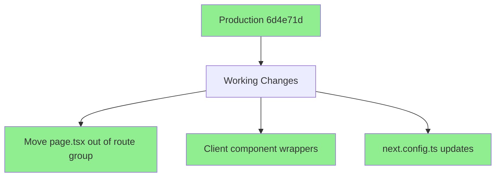
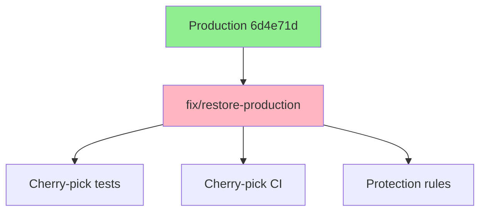

# Branch Fix Plan
Timestamp: 2024-02-27 11:29 CST

## Current State
- Production branch (6d4e71d) has working client reference manifest fix
- Main branch has new features but broke the fix
- Multiple feature branches need proper integration

## Working Changes (Must Preserve)


## Features to Integrate
1. Testing Infrastructure (e516f06)
   - Must preserve working route structure
   - Keep test configurations
   - Don't break client/server separation

2. GitHub Actions (a0d7966)
   - Keep workflow files
   - Maintain permissions
   - Don't affect build config

## Fix Steps
1. Create fix branch from production (✓ Done)
   ```bash
   git checkout -b fix/restore-production production
   ```

2. Cherry-pick testing infrastructure
   ```bash
   git cherry-pick -x e516f06
   ```
   - Resolve any conflicts keeping production route structure
   - Keep test configurations
   - Preserve client/server component separation

3. Cherry-pick GitHub Actions
   ```bash
   git cherry-pick -x a0d7966
   ```
   - Keep only workflow files
   - Don't take build config changes

4. Update branch protection
   ```mermaid
   graph TD
       A[Branch Rules] --> B[Production Branch]
       B --> C1[Require PR Review]
       B --> C2[Status Checks]
       B --> C3[Up-to-date]
       
       style A fill:#FFB6C1
       style B fill:#FFB6C1
   ```

   Rules to add:
   - Require pull request reviews
   - Require status checks to pass
   - Require branches to be up to date
   - Include administrators
   - Protect against force push

## Verification Steps
1. Build Check
   ```bash
   npm run build
   ```
   - Verify no client reference manifest errors
   - Check all routes work
   - Test client/server component separation

2. Test Infrastructure
   ```bash
   npm run test
   npm run test:e2e
   ```
   - Verify all tests pass
   - Check test coverage
   - Validate CI integration

3. Route Structure
   - Verify page.tsx location
   - Check client component wrappers
   - Test navigation flow

## Recovery Plan
If issues occur:
1. Reset to production (6d4e71d)
2. Re-apply changes one by one
3. Test after each change
4. Document any conflicts

## Branch Strategy


## Next Steps
1. Apply this fix
2. Update main branch
3. Sync all feature branches
4. Add branch protection
5. Document process in _DEV_MAN
