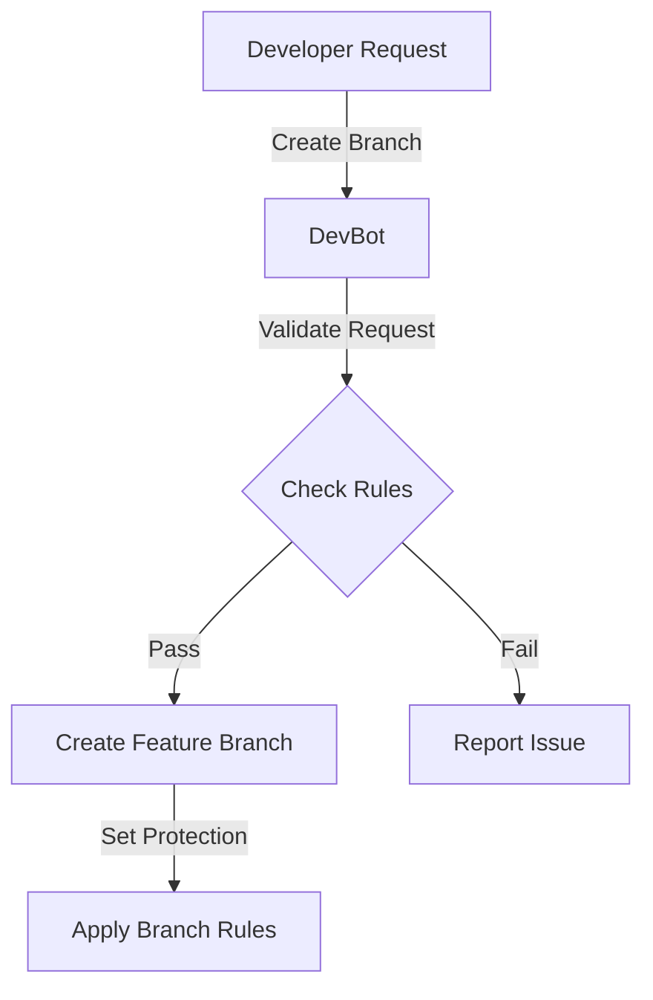
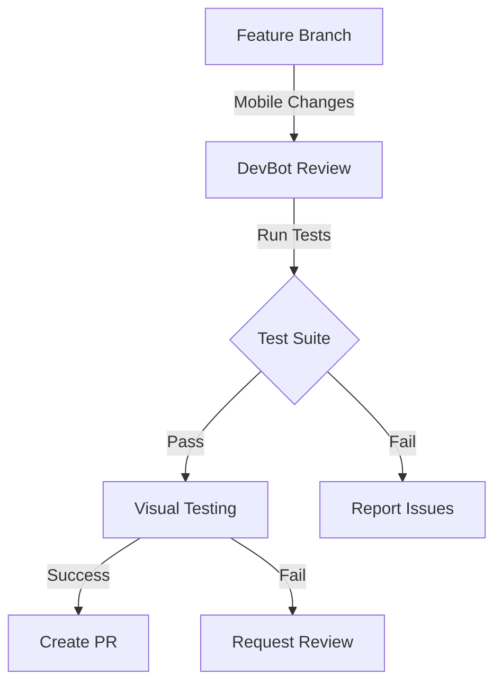
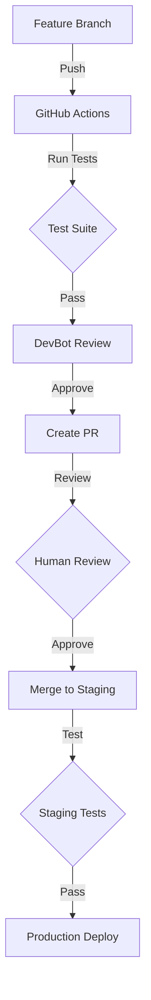

# Task: Mobile Optimization with Protected CI/CD Implementation
Timestamp: 2024-02-26 23:00
Agent: john(1.0.1)

## Current Status
- App is in production
- Need mobile view optimization
- Requires protected CI/CD pipeline
- Need AI agent integration safeguards

## Project Protection Requirements

### Critical Protection Points
1. Production stability
2. Package.json integrity
3. Core configuration files
4. Environment variables
5. Database schemas
6. Authentication flows

### .cursorignore Setup
Create a .cursorignore file to protect critical files:

```plaintext
# Critical Production Files
package.json
package-lock.json
next.config.js
middleware.ts
app/api/auth/[...nextauth]
prisma/schema.prisma

# Environment & Config
.env*
.npmrc
tsconfig.json

# Build & Deploy
.next/
build/
dist/
node_modules/

# CI/CD Config
.github/workflows/
```

## AI Agent Implementation

### DevOps Agent Profile
```yaml
name: "DevBot"
role: "CI/CD Guardian"
version: "1.0.0"
permissions:
  - create_feature_branches
  - submit_prs
  - run_tests
  - mobile_optimization
restricted:
  - production_branch
  - config_files
  - package_management
```

### GitHub Actions Workflow

1. **Feature Branch Creation**


2. **Mobile Optimization Workflow**


## Implementation Steps

1. **Setup Protected CI/CD (Week 1)**
   - Create GitHub Actions workflow files
   - Implement branch protection rules
   - Setup automated testing pipeline
   - Configure deployment safeguards

2. **DevBot Integration (Week 1-2)**
   - Implement OpenRouter API integration
   - Create DevBot permission system
   - Setup automated code review process
   - Implement change validation system

3. **Mobile Optimization (Week 2-3)**
   - Create mobile-view feature branch
   - Implement responsive design improvements
   - Add mobile-specific optimizations
   - Ensure no breaking changes

## Feature Branch Structure
```bash
feature/mobile-opt-${timestamp}
├── components/
│   └── mobile/
│       ├── optimized-layout/
│       └── responsive-components/
├── styles/
│   └── mobile-optimizations.css
└── tests/
    └── mobile/
        └── viewport-tests/
```

## CI/CD Pipeline


## Safety Measures

1. **Pre-Commit Hooks**
   - Lint checking
   - Type checking
   - Protected file validation
   - Package.json diff check

2. **Automated Checks**
   - Mobile viewport testing
   - Performance benchmarking
   - Bundle size monitoring
   - Accessibility compliance

3. **DevBot Restrictions**
   - No direct production access
   - No package.json modifications
   - No core config changes
   - Required test coverage

## Next Steps
1. Create .cursorignore file
2. Setup GitHub Actions workflow
3. Implement DevBot integration
4. Create mobile optimization feature branch
5. Setup automated testing pipeline

## Confidence Score
| Aspect | Score | Reasoning |
|--------|--------|-----------|
| CI/CD Setup | 95% | Industry standard practices |
| DevBot Integration | 90% | Clear boundaries and safeguards |
| Mobile Optimization | 85% | Isolated changes with protection |
| Production Safety | 98% | Multiple validation layers |

## Notes
- All changes isolated to feature branches
- Multiple validation layers before production
- AI agent restricted from critical files
- Automated testing requirements
- Human review requirements maintained 