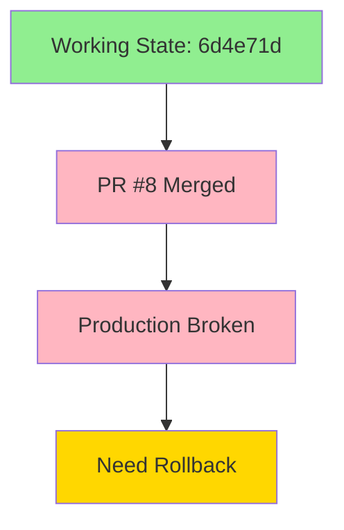
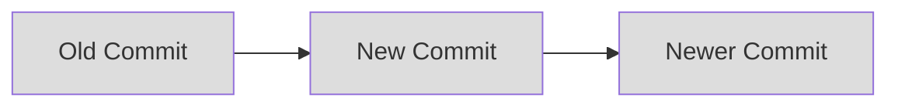
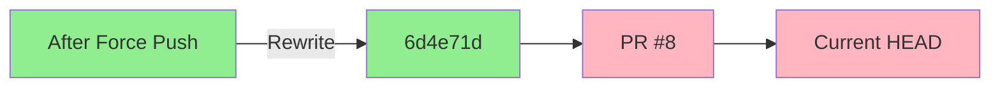

# Git Rollback Guide: Understanding Force Push and Recovery
Version: 1.0.0
Date: 2024-02-27 12:04 CST

## Our Current Situation



### Timeline
1. Last Working State: Commit 6d4e71d (11 hours ago)
   - Client manifest working
   - Routes functioning properly
   - Vercel deployment successful

2. PR #8 Merged (48 minutes ago)
   - Commit 8bf9b0d
   - Failed Vercel deployment
   - Production environment broken

## The Command Explained

```bash
git checkout 6d4e71d && git push origin 6d4e71d:production --force
```

This command is actually two commands combined with `&&`:

1. `git checkout 6d4e71d`
   - Moves our local HEAD to the specific commit
   - This commit is our last known working state
   - Does not affect remote repository yet

2. `git push origin 6d4e71d:production --force`
   - `origin`: The remote repository
   - `6d4e71d:production`: Push commit 6d4e71d to the production branch
   - `--force`: Override the remote history

### Why Force Push?

Normal git operations follow a "fast-forward" rule:


But our situation needs to go backward:


## Why This Is The Best Solution

1. **Speed of Recovery**
   - Immediate restoration of working state
   - No need for revert PRs or complex merges
   - Production back online fastest

2. **Cleanliness**
   - Removes broken commit entirely
   - Clean git history
   - No "revert of revert" situations

3. **Vercel Integration**
   - Vercel will deploy from the known working commit
   - Proven deployment state
   - Guaranteed working configuration

## Risks and Mitigations

1. **Loss of Recent Changes**
   - Any good changes in PR #8 will need to be re-implemented
   - Solution: Create new PR with only working changes

2. **Force Push Dangers**
   - Can overwrite remote history
   - Solution: Only use on protected branches in emergencies
   - Future: Implement branch protection to prevent this

## Confirmation

Yes, the command `git checkout 6d4e71d && git push origin 6d4e71d:production --force` will:
1. ✅ Reset production to last night's working state
2. ✅ Trigger a new Vercel deployment from the working commit
3. ✅ Restore the client manifest to working condition

## Future Prevention

1. **Branch Protection Rules**
   - Require PR reviews
   - Require successful Vercel deployments
   - Prevent force pushes except in emergencies

2. **Deployment Checks**
   - Add pre-merge deployment verification
   - Test client manifest generation
   - Verify route integrity

## Recovery Steps After Rollback

1. **Verify Deployment**
   - Watch Vercel deployment status
   - Confirm client manifest working
   - Test critical routes

2. **Document Changes Lost**
   - Review PR #8 changes
   - Create list of features to re-implement
   - Plan safer implementation approach

3. **Implement Protection**
   - Add branch protection rules
   - Set up required status checks
   - Document emergency procedures
