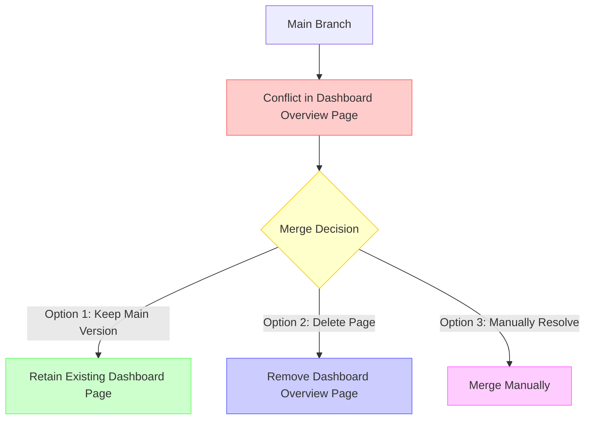
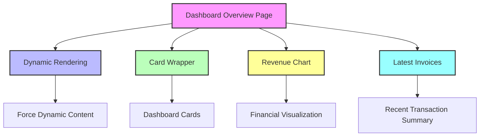

# Merge Plan v1.0

## Objective

Merge the `wip-tailwind-fix` branch into `main` while carefully managing the changes.

## Steps

1. Verify current state of `main` branch
2. Checkout `wip-tailwind-fix` branch
3. Review changes, focusing on layout and related functions and the database makeing sure the db is working like the rest of the app for the new layout. in wip-tailwind-fix
4. Merge only the layout.tsx and its associated functions
5. Resolve any conflicts
6. Test the merged changes thoroughly

## Caution

- Some AI-generated changes may need to be reverted
- Carefully review each change before merging
- Ensure no unintended modifications are introduced

## Rollback Strategy

- Keep a backup of the current state
- Be prepared to revert changes if unexpected issues arise

## Merge Conflict Analysis

### Specific Conflict

- **File**: `app/(auth)/dashboard/(overview)/page.tsx`
- **Conflict Type**: File Deletion Conflict

### Conflict Resolution Strategy

### Recommended Action

- Since we moved the `layout.tsx` file, we can safely keep the changes from the branch we are merging
- The layout move does not impact the dashboard overview page conflict
- Recommended to delete the conflicting file as it appears to be part of a restructuring

### Next Steps

1. Resolve the conflict by choosing to delete the file
2. Verify no critical functionality is lost
3. Proceed with merge
4. Thoroughly test the application after merge

## Merge Context: test/cross-repo-workflow into main

### Conflict Investigation: Dashboard Overview Page

#### Page Functionality Analysis

This page is critical for the dashboard's main view, providing:

- Dynamic rendering of dashboard content
- Card wrapper with key metrics
- Revenue chart visualization
- Latest invoices summary

#### Architectural Breakdown

#### Merge Recommendation

- **DO NOT DELETE** this page
- It is a core component of the dashboard functionality
- Contains important rendering logic and suspense boundaries
- Provides key business insights through cards, revenue chart, and invoices

#### Conflict Resolution Strategy

1. Preserve the existing page
2. Investigate why the branch wants to delete this file
3. Manually merge or keep the main branch version

### Next Steps

1. Carefully review the changes in the `test/cross-repo-workflow` branch
2. Understand why this page was targeted for deletion
3. Ensure no critical functionality is lost during merge
