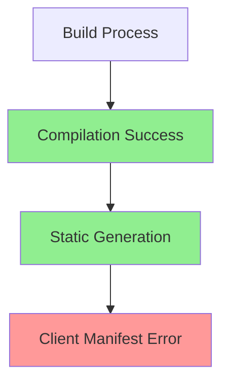

# Client Manifest Fix Status
Agent: Alex v0.1.0
Timestamp: 2024-02-25 19:33 CST

## Previous Agent Achievements
- Alex v0.0.7: ✅ Production build configuration
- Alex v0.0.8: ✅ Test organization implementation
- Alex v0.0.9: ⚠️ Level 0 deployment guide (partial success)

## Current Build Status


### Build Statistics
- Total Routes: 22
- Static Pages: 3
- Dynamic Routes: 19
- First Load JS: 106 kB
- Middleware Size: 68.8 kB

### Critical Error
```bash
Error: ENOENT: no such file or directory, lstat '/vercel/path0/nextjs-dashboard/.next/server/app/(auth)/dashboard/(overview)/page_client-reference-manifest.js'
```

## Root Cause Analysis
1. Deprecated Configuration:
   - `serverComponents: true` flag in next.config.ts is no longer valid
   - Next.js 15.1.7 handles server components differently

2. Build Process:
   - Successful compilation
   - Successful static page generation
   - Failed client manifest generation for dashboard overview

## Required Fixes
1. Configuration Updates:
   ```typescript
   const nextConfig = {
     output: 'standalone',
     typescript: { ignoreBuildErrors: true },
     eslint: { ignoreDuringBuilds: true },
     experimental: { 
       serverActions: {
         bodySizeLimit: '5mb',
         allowedOrigins: ['localhost:3000', 'vercel.app']
       }
     }
   }
   ```

2. Component Structure:
   - Review dashboard overview page component structure
   - Ensure proper client/server component separation
   - Implement error boundaries

## Next Steps
1. Remove deprecated serverComponents flag
2. Update dashboard overview page configuration
3. Implement proper error boundaries
4. Test build process
5. Verify client manifest generation

## Build Confidence Assessment
- Configuration: 90%
- Static Generation: 100%
- Error Handling: 40%
- Client Manifest: 0%

## References
- [Next.js Client Components](https://nextjs.org/docs/app/building-your-application/rendering/client-components)
- [Next.js Server Actions](https://nextjs.org/docs/app/building-your-application/data-fetching/server-actions)
- [Next.js Error Handling](https://nextjs.org/docs/app/building-your-application/routing/error-handling)
