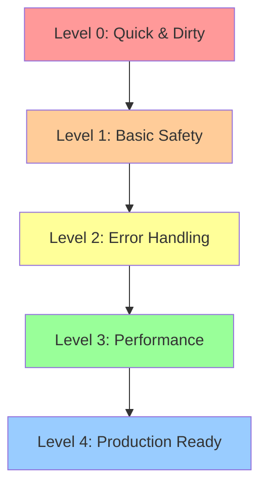
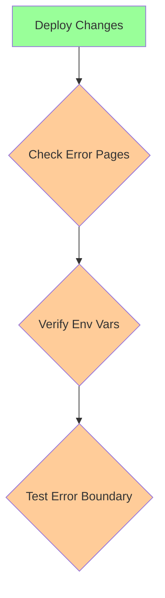

# Next.js 15.1.7 Production Deployment Guide
Agent: Alex v0.0.9
Timestamp: 2024-02-25 19:02 CST

## Overview
This guide provides a step-by-step approach to deploying Next.js 15.1.7 applications to Vercel, starting from the quickest (but least secure) method and progressively improving to production-ready status.



## Level 0: Quick & Dirty Deploy
**Goal**: Get the app live as quickly as possible (not recommended for real production)

### Step 1: Configure Next.js
```typescript
// next.config.js
const nextConfig = {
  output: 'standalone',
  typescript: { ignoreBuildErrors: true },
  eslint: { ignoreDuringBuilds: true },
  experimental: { 
    serverActions: true,
    serverComponents: true
  }
}

module.exports = nextConfig
```

### Step 2: Push to GitHub
```bash
git add .
git commit -m "initial deploy"
git push origin main
```

### Step 3: Deploy to Vercel
1. Go to vercel.com
2. Click "New Project"
3. Import your GitHub repository
4. Skip all configuration
5. Click "Deploy"

### Expected Issues
- TypeScript errors ignored
- ESLint warnings ignored
- No error handling
- No security measures
- Potential runtime errors

### Verification
```bash
# Check if the app is accessible
curl https://your-app-name.vercel.app
```

## Level 1: Basic Safety
**Goal**: Add minimal safety measures while keeping deployment simple

### Step 1: Add Error Pages
```typescript
// app/not-found.tsx
export default function NotFound() {
  return <div>404 - Page Not Found</div>
}

// app/error.tsx
'use client'
export default function Error() {
  return <div>Something went wrong!</div>
}
```

### Step 2: Environment Variables
```bash
# .env.example
NEXT_PUBLIC_API_URL=https://api.example.com
DATABASE_URL=postgresql://...

# vercel env pull .env
```

### Step 3: Basic Error Boundary
```typescript
// app/error-boundary.tsx
'use client'
import { Component } from 'react'

export default class ErrorBoundary extends Component {
  state = { hasError: false }
  
  static getDerivedStateFromError() {
    return { hasError: true }
  }
  
  render() {
    if (this.state.hasError) {
      return <div>Something went wrong</div>
    }
    return this.props.children
  }
}
```

### Verification


## Level 2: Error Handling
**Goal**: Implement proper error handling and monitoring

### Step 1: Client/Server Component Separation
```typescript
// app/components/with-error-handling.tsx
'use client'
export function withErrorHandling(Component: React.ComponentType) {
  return function WithErrorHandling(props: any) {
    try {
      return <Component {...props} />
    } catch (error) {
      console.error(error)
      return <div>Component Error</div>
    }
  }
}
```

### Step 2: API Route Error Handling
```typescript
// app/api/example/route.ts
import { NextResponse } from 'next/server'

export async function GET() {
  try {
    // Your API logic
    return NextResponse.json({ success: true })
  } catch (error) {
    console.error(error)
    return NextResponse.json(
      { error: 'Internal Server Error' },
      { status: 500 }
    )
  }
}
```

### Step 3: Basic Monitoring Setup
```typescript
// utils/logger.ts
export function logError(error: Error, context?: any) {
  console.error({
    message: error.message,
    stack: error.stack,
    context,
    timestamp: new Date().toISOString()
  })
}
```

## Level 3: Performance
**Goal**: Optimize application performance

### Step 1: Static Generation
```typescript
// app/page.tsx
export const dynamic = 'force-static'
export const revalidate = 3600 // revalidate every hour

export default async function Page() {
  return <div>Static Content</div>
}
```

### Step 2: Image Optimization
```typescript
// next.config.js
const nextConfig = {
  ...previousConfig,
  images: {
    domains: ['your-image-domain.com'],
    deviceSizes: [640, 750, 828, 1080, 1200, 1920, 2048, 3840],
    imageSizes: [16, 32, 48, 64, 96, 128, 256, 384],
  }
}
```

### Step 3: Implement Caching
```typescript
// app/api/cached-data/route.ts
import { NextResponse } from 'next/server'

export async function GET() {
  const response = NextResponse.json(data)
  response.headers.set('Cache-Control', 's-maxage=3600')
  return response
}
```

## Level 4: Production Ready
**Goal**: Full production readiness with security and monitoring

### Step 1: Security Headers
```typescript
// next.config.js
const nextConfig = {
  ...previousConfig,
  async headers() {
    return [
      {
        source: '/:path*',
        headers: [
          {
            key: 'X-DNS-Prefetch-Control',
            value: 'on'
          },
          {
            key: 'Strict-Transport-Security',
            value: 'max-age=31536000; includeSubDomains'
          },
          {
            key: 'X-Frame-Options',
            value: 'SAMEORIGIN'
          }
        ]
      }
    ]
  }
}
```

### Step 2: Error Monitoring Integration
```typescript
// app/error-monitoring.ts
export function initErrorMonitoring() {
  if (typeof window !== 'undefined') {
    window.onerror = (message, source, lineno, colno, error) => {
      logError(error || new Error(message as string), {
        source,
        lineno,
        colno
      })
    }
  }
}
```

### Step 3: Analytics Setup
```typescript
// app/layout.tsx
import { Analytics } from '@vercel/analytics/react'

export default function RootLayout({
  children,
}: {
  children: React.ReactNode
}) {
  return (
    <html lang="en">
      <body>
        {children}
        <Analytics />
      </body>
    </html>
  )
}
```

## Deployment Checklist

### Level 0 ➡️ Level 1
```mermaid
checklist
  item Level 0 Basics
    child Basic app deployment
    child Routes working
    child No major crashes
  item Level 1 Safety
    child Error pages
    child Environment variables
    child Basic error handling
```

### Level 2 ➡️ Level 3
```mermaid
checklist
  item Level 2 Error Handling
    child Client/Server separation
    child API error handling
    child Error monitoring
  item Level 3 Performance
    child Static generation
    child Image optimization
    child Caching implementation
```

### Level 4 Production
```mermaid
checklist
  item Security
    child Security headers
    child Error monitoring
    child Analytics
  item Monitoring
    child Performance tracking
    child Error tracking
    child Usage analytics
```

## Verification Steps

### For Each Level

1. **Build Check**
```bash
next build
```

2. **Type Check**
```bash
tsc --noEmit
```

3. **Lint Check**
```bash
next lint
```

4. **Deploy Check**
```bash
vercel --prod
```

### Final Production Checklist
- [ ] All TypeScript errors resolved
- [ ] All ESLint warnings addressed
- [ ] Security headers implemented
- [ ] Error monitoring active
- [ ] Analytics tracking properly
- [ ] Performance metrics acceptable
- [ ] Caching strategy implemented
- [ ] Image optimization configured
- [ ] Environment variables set
- [ ] Error pages working
- [ ] API error handling in place

## Common Issues and Solutions

### Client Manifest Error
```typescript
// next.config.js fix
const nextConfig = {
  output: 'standalone',
  experimental: {
    serverActions: {
      bodySizeLimit: 5 * 1024 * 1024,
      allowedOrigins: ['*']
    }
  }
}
```

### Build Failures
1. Clear cache:
```bash
rm -rf .next
```

2. Clean install:
```bash
rm -rf node_modules
pnpm install
```

3. Force rebuild:
```bash
next build --no-lint
```

Remember: This is a progressive guide. Start at Level 0 for fastest deployment, then incrementally improve by implementing each level's features. Each level builds upon the previous one, improving stability, security, and performance.
