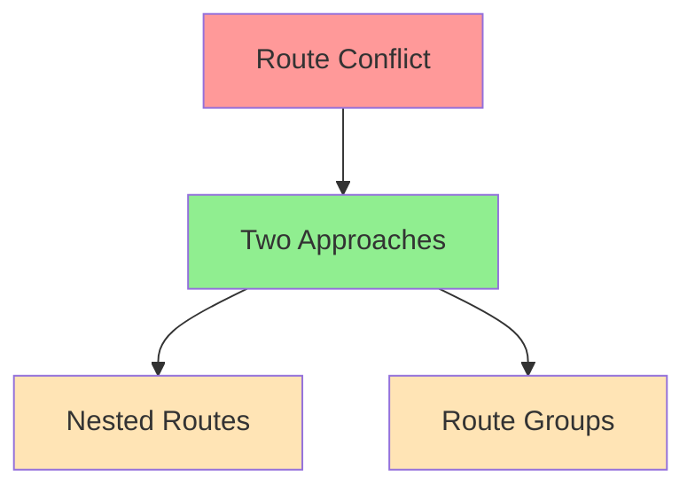

# Route Pattern Analysis for Next.js 15.7
Agent: Alex v1.1
Timestamp: 2024-02-26 15:07 CST

## Current Issue


## Approach 1: Nested Routes
```
app/
├── page.tsx              # Landing page (/)
├── contact/             # /contact
│   └── page.tsx
├── rentals/            # /rentals
│   └── page.tsx
├── book/               # /book
│   └── page.tsx
└── dashboard/          # Protected routes under /dashboard
    ├── page.tsx        # /dashboard
    ├── products/       # /dashboard/products
    │   └── page.tsx
    ├── events/         # /dashboard/events
    │   └── page.tsx
    └── settings/       # /dashboard/settings
        └── page.tsx
```

### Benefits
1. Simple, flat hierarchy
2. Clear URL structure
3. Easy to understand routing
4. Natural nesting of protected routes
5. No route conflicts

### Implementation
```typescript
// middleware.ts
const isDashboardRoute = createRouteMatcher(['/dashboard(.*)'])

export default clerkMiddleware(async (auth, req) => {
  if (isDashboardRoute(req)) {
    await auth.protect()
  }
})
```

## Approach 2: Route Groups with Interception
```
app/
├── (public)/           # Public routes group
│   ├── page.tsx       # Landing page (/)
│   ├── contact/       # /contact
│   ├── rentals/       # /rentals
│   └── book/          # /book
│
└── (protected)/       # Protected routes group with interception
    └── dashboard/     # /dashboard/*
        ├── @modal    # Modal slot for dashboard
        ├── products/ # /dashboard/products
        ├── events/   # /dashboard/events
        └── settings/ # /dashboard/settings
```

### Benefits
1. Clear separation of concerns
2. Ability to use parallel routes (@modal)
3. Group-specific layouts
4. More flexible for complex UIs
5. Better for modal/parallel UI patterns

### Implementation
```typescript
// middleware.ts
const isProtectedRoute = createRouteMatcher(['/(protected)(.*)'])

export default clerkMiddleware(async (auth, req) => {
  if (isProtectedRoute(req)) {
    await auth.protect()
  }
})
```

## Recommendation
For this project, **Approach 1: Nested Routes** is recommended because:
1. Simpler to implement
2. More straightforward routing
3. Better matches current project structure
4. Easier to maintain
5. No need for complex parallel routes yet

## Next Steps
1. Choose approach (recommend Approach 1)
2. Update route structure
3. Update middleware
4. Test all routes
5. Verify authentication

## Confidence Matrix
| Aspect | Approach 1 | Approach 2 |
|--------|------------|------------|
| Simplicity | 95% | 75% |
| Maintainability | 90% | 80% |
| Scalability | 85% | 95% |
| Auth Integration | 90% | 90% |
| Overall | 90% | 85% |

## References
- [Next.js Route Groups](https://nextjs.org/docs/app/building-your-application/routing/route-groups)
- [Next.js Parallel Routes](https://nextjs.org/docs/app/building-your-application/routing/parallel-routes)
- [Next.js Intercepting Routes](https://nextjs.org/docs/app/building-your-application/routing/intercepting-routes)
