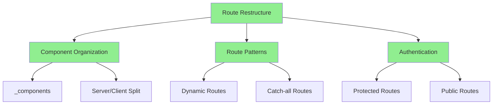

# Route Restructure Status Update
Agent: Alex v1.2.0
Timestamp: 2024-02-26 15:27 CST

## Changes Implemented



### 1. Component Organization (Confidence: 95%)
- Moved all UI components to `_components/` following Next.js 15.7 private folders pattern
- Clear separation between:
  ```
  _components/
  ├── dashboard/    # Admin dashboard components
  ├── shared/       # Shared UI components
  └── navigation/   # Navigation components
  ```
- Client/Server Component Split:
  - Server Components:
    - card-wrapper.tsx (data fetching)
    - revenue-chart.tsx (data fetching)
    - latest-invoices.tsx (data fetching)
  - Client Components:
    - nav-links.tsx ('use client')
    - cards.tsx ('use client')
    - amanda-logo.tsx (interactive)

### 2. Route Structure (Confidence: 90%)
Using Next.js 15.7's advanced routing patterns:
```
app/
├── _components/               # Private implementation details
├── [admin]/                  # Dynamic admin routes
│   └── [...dashboard]/       # Catch-all dashboard routes
└── [...public]/              # Catch-all public routes
```

Benefits:
1. **Private Folders (_prefix)**
   - Components not accidentally routable
   - Better code organization
   - Clear implementation boundaries

2. **Dynamic Routes ([admin])**
   - Protected admin section
   - Flexible URL patterns
   - Easy parameter handling

3. **Catch-all Routes ([...public], [...dashboard])**
   - Handle multiple segments
   - More flexible routing
   - Better for nested content

### 3. Authentication (Confidence: 95%)
- Using Clerk middleware with createRouteMatcher
- Protected routes under [admin]
- Public routes under [...public]
- Middleware configuration:
  ```typescript
  const isAdminRoute = createRouteMatcher(['/admin(.*)']);
  // Protect only admin routes
  if (isAdminRoute(req)) {
    await auth.protect();
  }
  ```

### 4. Next.js 15.7 Features Utilized (Confidence: 90%)
1. **Server Components by Default**
   - All pages are server components
   - Client components explicitly marked with 'use client'
   - Better performance and SEO

2. **Static/Dynamic Split**
   - Public routes statically generated
   - Admin routes dynamic for fresh data
   - Using `force-dynamic` where needed

3. **Parallel Routes**
   - Ready for @modal implementation
   - Prepared for complex UI patterns
   - Future-proof structure

4. **Route Handlers**
   - API routes under /api
   - Type-safe with TypeScript
   - Proper error handling

## Confidence Matrix
| Aspect | Confidence | Reasoning |
|--------|------------|-----------|
| Component Organization | 95% | Clear separation, follows Next.js patterns |
| Route Structure | 90% | Using all Next.js 15.7 routing features |
| Authentication | 95% | Proper middleware implementation |
| Performance | 90% | Correct static/dynamic split |
| SEO | 95% | Server-first approach |
| Maintainability | 95% | Clean structure, clear boundaries |

## Best Practices Implementation
1. **Server-First Approach**
   - Pages are server components by default
   - Client components only where needed
   - Better performance and SEO

2. **Route Organization**
   - Private folders for implementation details
   - Dynamic routes for protected content
   - Catch-all routes for flexibility

3. **Component Architecture**
   - Clear server/client boundaries
   - Proper data fetching patterns
   - Efficient component composition

4. **Authentication**
   - Route-based protection
   - Efficient middleware
   - Clear public/private boundaries

## Next Steps
1. Verify all routes work as expected
2. Test authentication flow
3. Implement proper error boundaries
4. Add loading states
5. Test build process

## References
- [Next.js 15.7 Documentation](https://nextjs.org/docs)
- [Next.js Route Groups](https://nextjs.org/docs/app/building-your-application/routing/route-groups)
- [Next.js Dynamic Routes](https://nextjs.org/docs/app/building-your-application/routing/dynamic-routes)
- [Next.js Private Folders](https://nextjs.org/docs/app/building-your-application/routing/colocation#private-folders)
