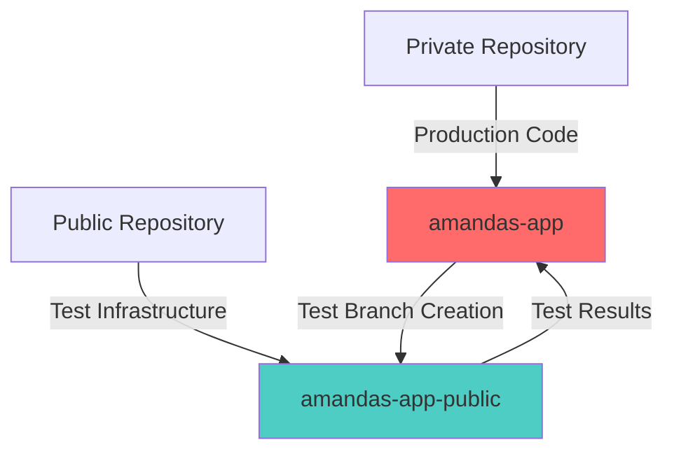
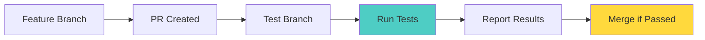

# Cross-Repository Testing Setup Handoff
Last Updated: 2024-02-27 14:42 CST

## Overview

We've established a dual-repository setup for Amanda's Enterprise Dashboard:

## Accomplishments

### 1. Repository Structure
- **Private Repository (amandas-app)**
  - Contains production code
  - Holds sensitive configurations
  - Maintains documentation in _DEV_MAN
  - Branch structure:
    * production (protected)
    * pre-production
    * main
    * feature branches

- **Public Repository (amandas-app-public)**
  - Dedicated to testing infrastructure
  - Configured with GitHub Actions
  - Branch protection rules implemented
  - Local font configuration for reliable builds

### 2. CI/CD Implementation

- Automated test branch creation
- Comprehensive test suite setup:
  * Unit tests
  * Integration tests
  * E2E tests (Playwright)
  * Security scanning (CodeQL)

### 3. Workflow Automation
- GitHub Actions configured for:
  * Test execution
  * Build verification
  * Result reporting
  * PR status updates

## Current Status

### Working Features
1. ✅ Branch protection rules
2. ✅ Local font configuration
3. ✅ Test infrastructure setup
4. ✅ Cross-repo automation

### In Progress
1. ⏳ Test execution verification
2. ⏳ Full workflow testing
3. ⏳ Documentation updates

## Next Steps

### 1. Immediate Tasks
- Verify test execution in public repo
- Complete workflow testing
- Update documentation in private repo

### 2. Future Improvements
- Enhanced error reporting
- Automated deployment triggers
- Performance optimization

## Important Notes

1. Repository Management:
   - Keep sensitive code in private repo
   - Use public repo only for testing
   - Maintain documentation in private repo

2. Workflow Rules:
   - Always create PRs for changes
   - Wait for test results before merging
   - Keep documentation updated

3. Branch Protection:
   - No direct pushes to protected branches
   - Required reviews enforced
   - All tests must pass

## Reference Documentation

1. Key Files:
   - `_DEV_MAN/ci-cd/workflow-status.md`
   - `_DEV_MAN/ci-cd/cross-repo-testing.md`
   - `_DEV_MAN/agnet-history/alex.md`

2. GitHub Actions:
   - `.github/workflows/test-branch-creation.yml`
   - `.github/workflows/run-tests.yml`
   - `.github/workflows/process-test-results.yml`

## Warning ⚠️

1. Never bypass protection rules
2. Keep repositories in sync
3. Document all major changes
4. Follow established workflows

## Success Criteria

For any changes:
1. Tests pass in public repo
2. Documentation updated
3. PRs properly reviewed
4. Changes documented in _DEV_MAN/COMPLETED

Remember to read `alex.md` for context and history of the project's development approach.
