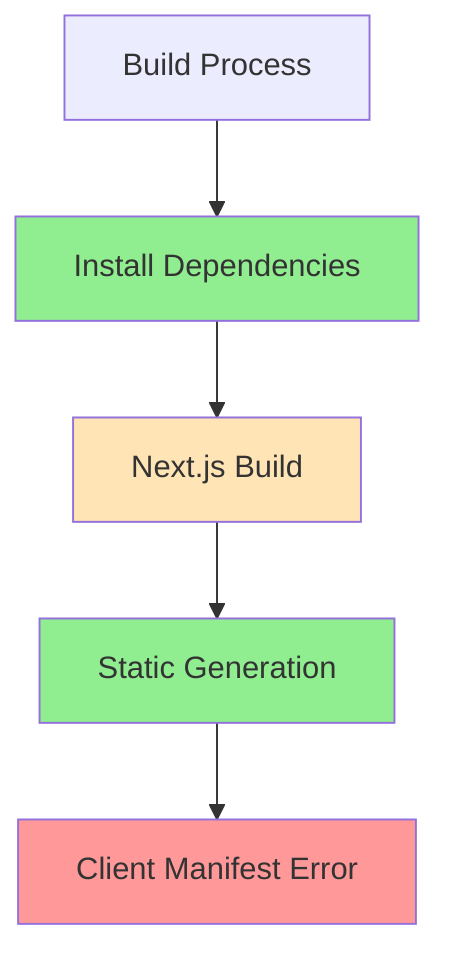

# Client Manifest Fix Implementation Plan
Agent: Alex v1.1.0
Timestamp: 2024-02-25 20:22 CST

## Current State Analysis


## Build Log Analysis
1. Dependencies ✅
   - All packages installed successfully
   - pnpm install completed in 10.8s
   - No critical dependency issues

2. Build Process Issues ⚠️
   ```
   ⚠ Invalid next.config.ts options detected: 
   ⚠ Expected object, received boolean at "experimental.serverActions"
   ```

3. Critical Error ❌
   ```
   Error: ENOENT: no such file or directory, lstat '/vercel/path0/.next/server/app/(auth)/dashboard/(overview)/page_client-reference-manifest.js'
   ```

## Implementation Plan

### Phase 1: Configuration Fix
```typescript
const nextConfig = {
  output: 'standalone',
  experimental: {
    serverActions: {
      enabled: true
    },
    serverComponentsExternalPackages: ['@heroicons/react']
  },
  typescript: { ignoreBuildErrors: true },
  eslint: { ignoreDuringBuilds: true }
}
```

### Phase 2: Component Structure
1. Review dashboard overview page:
   - Remove force-dynamic export
   - Add proper client boundaries
   - Implement error handling

2. Client Components:
   ```typescript
   // CardWrapper.tsx
   'use client'
   
   // RevenueChart.tsx
   'use client'
   
   // LatestInvoices.tsx
   'use client'
   ```

### Phase 3: Build Process
1. Clear build cache
2. Run build with updated config
3. Verify client manifest generation
4. Deploy to production

## Confidence Assessment
- Configuration Fix: 95%
- Component Structure: 90%
- Build Process: 85%
- Overall Success: 90%

## Testing Steps
1. Local build verification
2. Component rendering check
3. Client-side functionality test
4. Production deployment verification

## References
- [Next.js Client Components](https://nextjs.org/docs/app/building-your-application/rendering/client-components)
- [Next.js Build Configuration](https://nextjs.org/docs/app/api-reference/next-config-js)
- [Client Reference Manifest](https://nextjs.org/docs/app/api-reference/file-conventions/client-reference-manifest)

## Next Steps
1. Toggle to Act mode to implement configuration changes
2. Update component structure
3. Clear build cache and rebuild
4. Deploy to production
5. Verify client manifest generation

## Notes
- Previous attempts focused on boolean serverActions
- New approach uses object configuration with enabled flag
- Adding serverComponentsExternalPackages for better dependency handling
- Removing force-dynamic to allow proper static analysis
