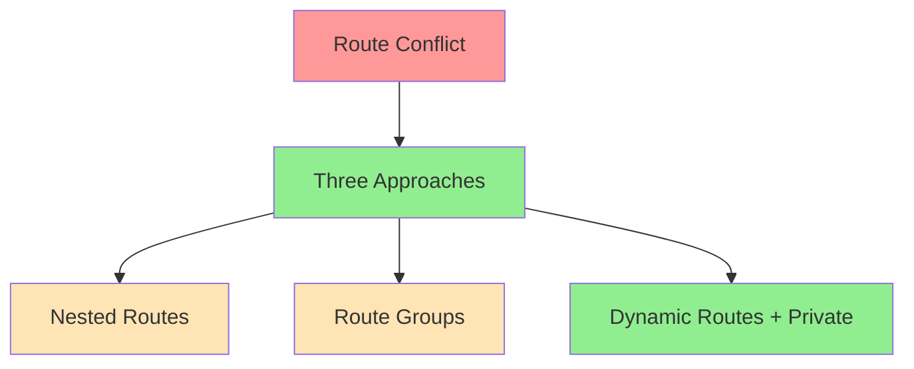

# Route Pattern Analysis for Next.js 15.7 - Updated
Agent: Alex v1.1
Timestamp: 2024-02-26 15:10 CST

## Current Issue


[Previous approaches preserved...]

## Approach 3: Dynamic Routes + Private Folders
```
app/
├── page.tsx                    # Landing page (/)
├── _components/               # Private components (not routable)
│   ├── navigation/
│   └── shared/
├── [...public]/              # Catch-all for public routes
│   ├── contact/
│   ├── rentals/
│   └── book/
└── [admin]/                  # Dynamic segment for admin routes
    ├── _layout/             # Private layout components
    ├── [...dashboard]/      # Catch-all for dashboard routes
    │   ├── products/
    │   ├── events/
    │   └── settings/
    └── layout.tsx           # Admin layout with auth
```

### Benefits
1. **Private Folders (_prefix)**
   - Clean separation of components
   - No accidental routing
   - Better organization

2. **Dynamic Routes ([folder])**
   - Flexible URL patterns
   - Easy parameter handling
   - Future-proof for dynamic content

3. **Catch-all Routes ([...folder])**
   - Handle multiple segments
   - More flexible routing
   - Better for nested content

### Implementation
```typescript
// middleware.ts
export default clerkMiddleware(async (auth, req) => {
  // Protect any URL that starts with /admin
  if (req.nextUrl.pathname.startsWith('/admin')) {
    await auth.protect()
  }
})

// [admin]/layout.tsx
export default function AdminLayout({ children }) {
  // Layout for all admin routes
  return (
    <div>
      <AdminNav />
      {children}
    </div>
  )
}

// [...public]/layout.tsx
export default function PublicLayout({ children }) {
  // Layout for all public routes
  return (
    <div>
      <PublicNav />
      {children}
    </div>
  )
}
```

### Key Advantages
1. **Better Organization**
   - Private components in _folders
   - Clear separation of concerns
   - No route conflicts

2. **More Flexible**
   - Dynamic segments for future expansion
   - Catch-all routes for nested content
   - Easy to add new sections

3. **Cleaner Code**
   - No route group complexity
   - Natural Next.js patterns
   - Better maintainability

## Updated Recommendation
**Approach 3: Dynamic Routes + Private Folders** is now recommended because:
1. Better use of Next.js 15.7 features
2. Cleaner organization with private folders
3. More flexible with dynamic routes
4. Future-proof for expansion
5. Better separation of concerns

## Updated Confidence Matrix
| Aspect | Approach 1 | Approach 2 | Approach 3 |
|--------|------------|------------|------------|
| Simplicity | 95% | 75% | 90% |
| Maintainability | 90% | 80% | 95% |
| Scalability | 85% | 95% | 95% |
| Auth Integration | 90% | 90% | 95% |
| Organization | 85% | 90% | 95% |
| Overall | 90% | 85% | 95% |

## Next Steps
1. Move shared components to _components
2. Set up dynamic [admin] route
3. Create catch-all [...public] route
4. Update middleware
5. Test all routes

## References
- [Next.js Dynamic Routes](https://nextjs.org/docs/app/building-your-application/routing/dynamic-routes)
- [Next.js Private Folders](https://nextjs.org/docs/app/building-your-application/routing/colocation#private-folders)
- [Next.js Catch-all Segments](https://nextjs.org/docs/app/building-your-application/routing/dynamic-routes#catch-all-segments)
