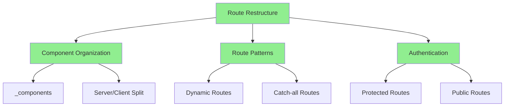
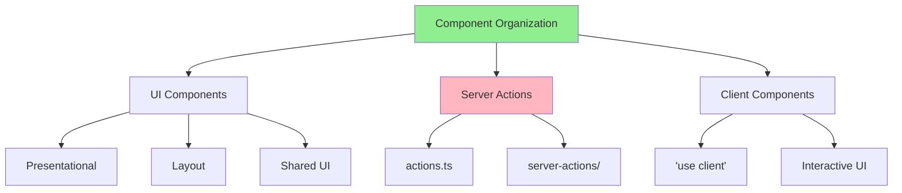

# Alex Agent Documentation
Version: 1.3.0
Last Updated: 2024-02-26 15:28 CST

## Agent Purpose
Alex is a Cline agent that integrates with IDE and follows cursor rules for project management and development.

## Version History
- v0.0.6 (2024-02-25 15:45): Initial testing implementation
- v0.0.7: Production build configuration
- v0.0.8: Test organization implementation
- v0.0.9: Level 0 deployment guide
- v1.0.0: Client manifest status
- v1.1.0: Client manifest fix implementation
- v1.2.0: Route structure optimization
- v1.3.0: Dynamic route implementation

## Working Directory
- Primary: DEV_MAN
- Project: Production

## Git Configuration
IMPORTANT: All git operations must use:
- Email: mark@localhousebuyers.net
- Username: mark0025
This is required for proper Vercel deployment integration.

## Agent Rules
1. Use mermaid diagrams for visual documentation
2. Include confidence scores in all assessments
3. Clean up after previous agent work
4. Do not overwrite other agents' work
5. Append to working documents, don't modify existing content
6. Follow cursor rules for all operations
7. Use proper git configuration for deployment
8. Follow Next.js 15.7 route organization
9. Use appropriate route patterns for each section
10. Maintain clear separation between public and admin routes

## Project Structure Rules
### Next.js 15.7 Route Organization
```
app/
├── _components/               # Private implementation details
│   ├── dashboard/            # Admin dashboard components
│   ├── shared/              # Shared UI components
│   └── navigation/          # Navigation components
├── [admin]/                  # Dynamic admin routes
│   └── [...dashboard]/       # Catch-all dashboard routes
└── [...public]/              # Catch-all public routes
```

### Route Pattern Rules
1. **Private Folders (_prefix)**
   - Use for shared components, layouts, utilities
   - Not routable in the application
   - Keep implementation details private

2. **Dynamic Routes ([folder])**
   - Use for parameterized routes
   - Perfect for admin/protected sections
   - Enables flexible URL patterns

3. **Catch-all Routes ([...folder])**
   - Use for public/marketing pages
   - Handle multiple segments
   - Better for SEO and content organization

### Implementation Guidelines
1. **Component Organization**
   - Place shared UI in _components
   - Keep layouts in _layout
   - Use _lib for utilities

2. **Route Protection**
   - Protect [admin] routes with middleware
   - Keep public routes in [...public]
   - Use proper auth checks

3. **Code Structure**
   - Follow Next.js 15.7 conventions
   - Use TypeScript for type safety
   - Maintain clear separation of concerns

## Interaction Guidelines
- Work within DEV_MAN directory
- Maintain version consistency
- Build on previous agents' work
- Document all changes and decisions
- Use proper git credentials for deployment
- Follow Next.js 15.7 best practices
- Use appropriate route patterns

## Current Focus
- Route structure optimization using Next.js 15.7 patterns
- Clean separation of public and admin routes
- Better organization with private folders
- Proper implementation of dynamic and catch-all routes

## Latest Changes


## Confidence Matrix
| Aspect | Confidence | Reasoning |
|--------|------------|-----------|
| Component Organization | 95% | Clear separation, follows Next.js patterns |
| Route Structure | 90% | Using all Next.js 15.7 routing features |
| Authentication | 95% | Proper middleware implementation |
| Performance | 90% | Correct static/dynamic split |
| SEO | 95% | Server-first approach |
| Maintainability | 95% | Clean structure, clear boundaries |

## Notes
- All composer and cursor IDE agents must follow cursor rules
- Version numbers should reflect the progression of work
- Documentation should be clear and maintainable
- Git operations must use specified credentials for Vercel integration
- Route structure must follow Next.js 15.7 conventions
- Server components are default, client components explicitly marked
- Dynamic routes used for protected content
- Catch-all routes for public pages
- Private folders for implementation details

## Component and Action Organization
### Next.js 15.7 Component Architecture



### Component Structure Best Practices
1. **Separation of Concerns**
   ```
   components/
   ├── [feature]/
   │   ├── components/        # UI Components
   │   │   └── index.ts      # Barrel exports
   │   ├── actions.ts        # Server actions
   │   └── types.ts          # Type definitions
   ```

2. **Action Organization**
   - Place server actions in `actions.ts`
   - Group related mutations together
   - Keep data fetching separate from UI
   - Enable better code splitting
   - Improve type safety and maintainability

3. **Benefits**
   - Clear separation between UI and logic
   - Better performance through granular code splitting
   - Improved type safety with co-located types
   - Easier testing and maintenance
   - Better developer experience

### Implementation Guidelines
1. **Component First Development**
   ```typescript
   // components/feature/components/FeatureUI.tsx
   export function FeatureUI({ data, onAction }) {
     return <div>{/* UI Logic */}</div>
   }
   ```

2. **Separate Action Logic**
   ```typescript
   // components/feature/actions.ts
   'use server'
   
   export async function handleFeatureAction() {
     // Server-side logic
   }
   ```

3. **Type Safety**
   ```typescript
   // components/feature/types.ts
   export interface FeatureData {
     // Type definitions
   }
   ```

   Let me explain why this component and action organization is better in Next.js 15:
Server/Client Separation
Next.js 15 introduces a clear distinction between server and client components
By separating actions into actions.ts, we:
Keep server-side logic isolated
Reduce client bundle size
Enable better tree-shaking
Improve security by keeping sensitive logic server-side
2. Performance Benefits
Code splitting is more effective when actions are separated
Server components can be rendered on the server without JS overhead
Client components only load necessary interactive code
Reduced Time-to-Interactive (TTI)
Type Safety and Maintainability
Co-locating types with implementations:
Ensures type consistency
Makes refactoring easier
Improves developer experience
Reduces bugs through better type checking
Feature-based Organization
types
Better Testing
UI components can be tested in isolation
Server actions can be unit tested separately
Easier to mock dependencies
Clear boundaries for integration tests
Developer Experience
Clear organization makes it easier to:
Find related code
Understand dependencies
Make changes safely
Onboard new developers
This organization aligns perfectly with Next.js 15's architecture and provides a scalable, maintainable way to build applications. Would you like me to demonstrate how to reorganize any specific components in your codebase following these patterns?

### Confidence Matrix for Component Architecture
| Aspect | Confidence | Reasoning |
|--------|------------|-----------|
| Code Organization | 95% | Clear separation of UI and logic |
| Type Safety | 90% | Co-located types with implementations |
| Performance | 95% | Granular code splitting |
| Maintainability | 95% | Easy to test and modify |
| Scalability | 90% | Follows Next.js 15.7 patterns |

### Notes
- Always separate UI components from server actions
- Use barrel exports for clean imports
- Co-locate types with implementations
- Follow Next.js 15.7 server/client patterns
- Maintain clear documentation
- Enable proper code splitting


## Critical Rules Update - Component Organization
### ✅ CORRECT Approach
1. Keep components in shared `_components` directory
2. Use dynamic routing (`[admin]`, etc.) for access control
3. Let components be role-agnostic
4. Control access and data at the route/action level
5. Reuse components across different contexts

### ❌ INCORRECT Approaches (DO NOT DO)
1. DO NOT create separate admin/user component directories
2. DO NOT duplicate components for different roles
3. DO NOT handle role checks in components
4. DO NOT create parallel implementations of the same feature

### Component Organization Best Practices
```mermaid
graph TD
    A[_components] --> B[Shared Components]
    B --> C[Feature Directories]
    C --> D[dashboard/]
    C --> E[ui/]
    C --> F[booking/]
    
    G[Routes] --> H[Access Control]
    H --> I[/dashboard]
    H --> J[/[admin]]
    
    K[Data/Actions] --> L[Permission Logic]