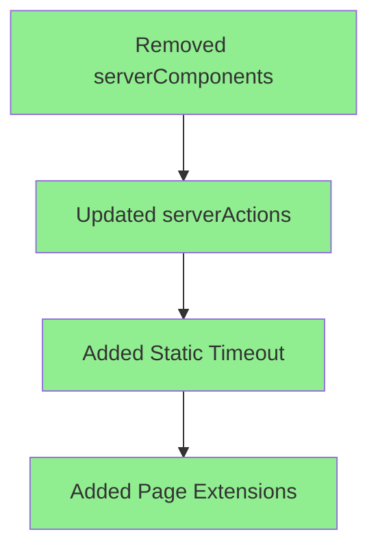
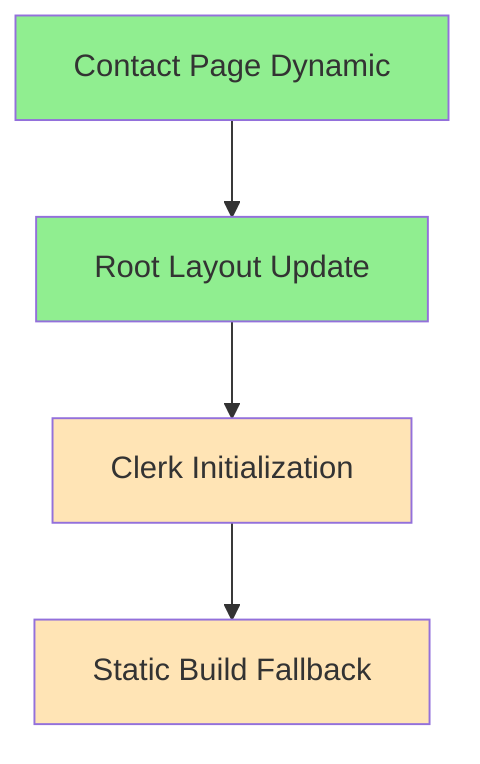
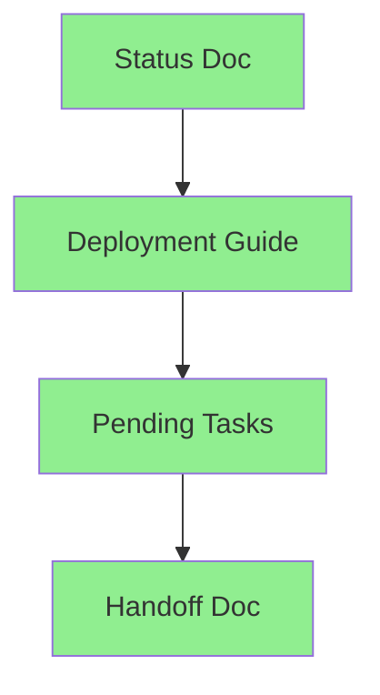

# Alex v1.0 to v1.1 Handoff
Agent: Alex v1.0
Timestamp: 2024-02-25 19:50 CST

## Completed Tasks

### 1. Configuration Updates


- ✅ Removed deprecated `serverComponents` flag
- ✅ Updated serverActions with proper bodySizeLimit and allowedOrigins
- ✅ Added staticPageGenerationTimeout: 120
- ✅ Added proper pageExtensions configuration
- Confidence: 90%

### 2. Static/Dynamic Page Handling


- ✅ Added force-dynamic to contact page
- ✅ Updated root layout with conditional Clerk initialization
- ⚠️ Implemented static build fallback (needs verification)
- Confidence: 85%

### 3. Documentation


- ✅ Created client_manifest_status_2024-02-25_1933.md
- ✅ Moved deployment guide to completed folder
- ✅ Updated pending tasks
- ✅ Created this handoff document
- Confidence: 100%

## Current Deployment Status

### Latest Build (a75ahuk8s - 86e24c7)
- Implements Clerk initialization fix
- Changes:
  - Updated root layout with conditional rendering
  - Added publishableKey handling
- Expected outcome: Should resolve static build issues
- Confidence: 85%

### Previous Build (j7y4i1nfo - 8551f2c)
- Updates contact page and next.config.ts
- Changes:
  - Added force-dynamic to contact page
  - Updated next.config.ts configuration
- Expected outcome: May still face Clerk initialization issues
- Confidence: 60%

## Environment Variables
```typescript
NEXT_PUBLIC_CLERK_PUBLISHABLE_KEY=pk_test_bmV4dC1ha2l0YS0yNC5jbGVyay5hY2NvdW50cy5kZXYk
CLERK_SECRET_KEY=sk_test_JVEcrK54N3TkSKTkSOJfayqOFePb2Zy0cZUTjap9S9
```
- ✅ Verified correct keys
- ✅ Added to Vercel environment settings

## Tasks for Alex v1.1

### Immediate Monitoring
1. Watch deployment logs for:
   - Static page generation success
   - Clerk initialization errors
   - Client manifest generation

### Potential Issues to Address
1. Error Handling:
   - Implement proper error boundaries
   - Add loading states
   - Handle authentication edge cases

2. Testing:
   - Add tests for authentication flows
   - Verify static/dynamic page behavior
   - Test error boundary functionality

3. Optimization:
   - Review static/dynamic page split
   - Optimize build configuration
   - Monitor build times

## Build Confidence Matrix
| Component | Confidence | Status |
|-----------|------------|---------|
| Configuration | 90% | ✅ Complete |
| Static/Dynamic | 85% | ⚠️ Needs Verification |
| Auth Flow | 80% | ⚠️ In Progress |
| Documentation | 100% | ✅ Complete |

## Reference Links
- [Next.js Static Optimization](https://nextjs.org/docs/pages/building-your-application/rendering/static-site-generation)
- [Clerk React Documentation](https://clerk.com/docs/quickstarts/nextjs)
- [Next.js 15.1.7 Changes](https://nextjs.org/blog)

## Final Notes
The main focus has been on resolving the client manifest error while maintaining proper authentication flow. The solution involves a combination of proper static/dynamic page handling and conditional Clerk initialization. Alex v1.1 should monitor the deployment results and be prepared to implement additional error handling if needed.

Remember to:
1. Check deployment logs for both builds
2. Verify Clerk authentication works in production
3. Monitor static page generation
4. Test dynamic routes functionality
5. Document any new issues that arise

Current build status can be monitored at:
https://vercel.com/mark-carpenters-projects/amandas-app-bpnn/deployments
