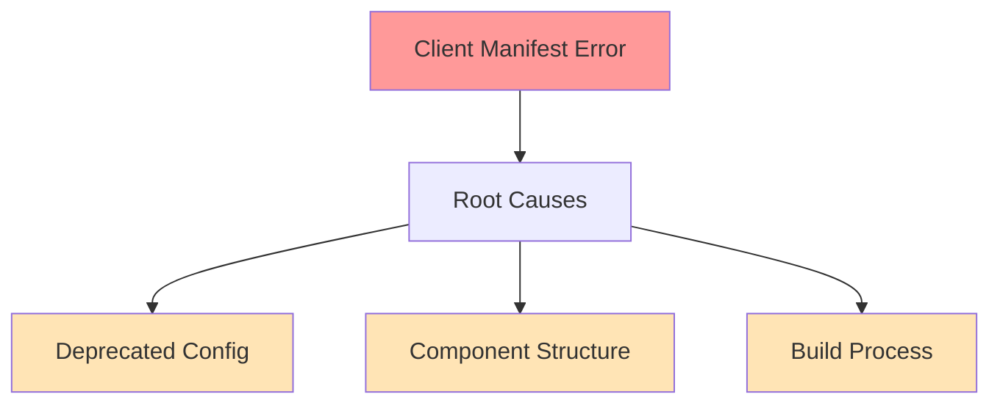

# Client Manifest Fix Implementation Plan
Agent: Alex v0.1.0
Timestamp: 2024-02-25 19:33 CST

## Current Issue


## Implementation Steps

### 1. Configuration Update
```typescript
const nextConfig = {
  output: 'standalone',
  typescript: { ignoreBuildErrors: true },
  eslint: { ignoreDuringBuilds: true },
  experimental: { 
    serverActions: {
      bodySizeLimit: '5mb',
      allowedOrigins: ['localhost:3000', 'vercel.app']
    }
  }
}
```

### 2. Component Structure Review
1. Dashboard Overview Page:
   - Verify 'use client' directives
   - Check component boundaries
   - Implement error handling

2. Client/Server Separation:
```typescript
// Layout structure
app/
  (auth)/
    dashboard/
      (overview)/
        error.tsx       // Client error boundary
        loading.tsx     // Loading state
        page.tsx        // Server component
        layout.tsx      // Root layout
```

### 3. Error Boundary Implementation
```typescript
'use client'

export default function DashboardError({
  error,
  reset,
}: {
  error: Error & { digest?: string }
  reset: () => void
}) {
  return (
    <div className="flex h-full flex-col items-center justify-center">
      <h2 className="text-center">Something went wrong!</h2>
      <button
        className="mt-4 rounded-md bg-blue-500 px-4 py-2 text-sm text-white"
        onClick={() => reset()}
      >
        Try again
      </button>
    </div>
  )
}
```

### 4. Build Process Verification
1. Clear build cache:
```bash
rm -rf .next
pnpm install
pnpm build
```

2. Verify manifest generation:
```bash
ls .next/server/app/(auth)/dashboard/(overview)/
```

## Testing Strategy
1. Unit Tests:
   - Error boundary behavior
   - Component rendering
   - Server action calls

2. Integration Tests:
   - Dashboard page loading
   - Error handling
   - Client/server boundaries

## Success Criteria
- [ ] Build completes without manifest errors
- [ ] Dashboard overview page loads correctly
- [ ] Error boundaries catch and display errors
- [ ] All tests pass

## Monitoring
1. Build Logs:
   - Watch for manifest generation
   - Check for component compilation
   - Verify static optimization

2. Runtime Checks:
   - Page load performance
   - Error boundary triggers
   - Server action execution

## Rollback Plan
If issues persist:
1. Revert to previous working configuration
2. Document failed approaches
3. Consider alternative component structure

## Next Steps
1. Implement configuration changes
2. Add error boundaries
3. Test build process
4. Deploy and verify
