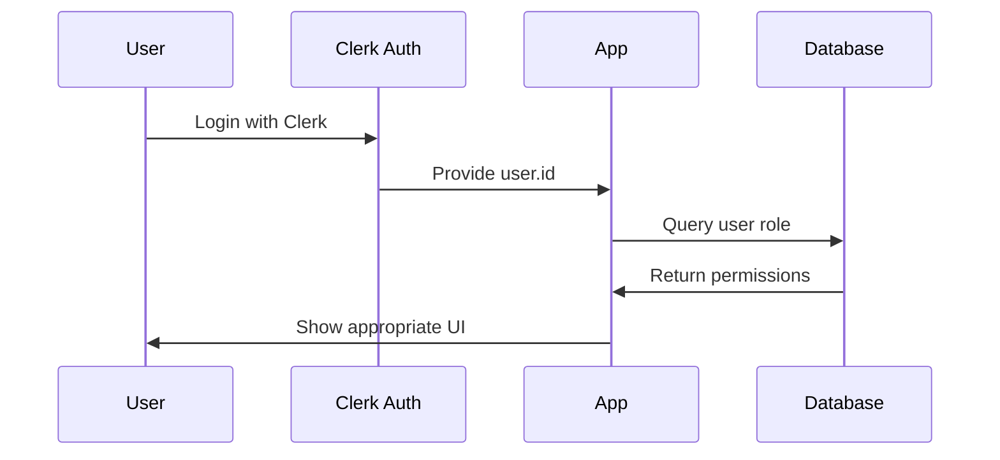
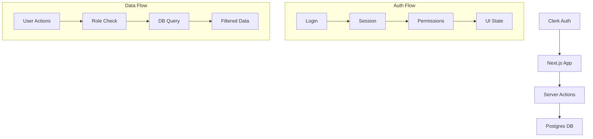

# Authentication System Status Update
Status: In Progress
Timestamp: 2024-02-24 18:07 CST

## Recent Changes Overview

### Database Schema Updates
```sql
-- New users table for auth
CREATE TABLE users (
  id VARCHAR(255) PRIMARY KEY,
  clerk_id VARCHAR(255) UNIQUE NOT NULL,
  role VARCHAR(50) NOT NULL DEFAULT 'user',
  first_name VARCHAR(255),
  last_name VARCHAR(255),
  email VARCHAR(255)
);

-- Updated bookings table with auth fields
CREATE TABLE bookings (
  id VARCHAR(255) PRIMARY KEY,
  event_id VARCHAR(255) NOT NULL,
  date TIMESTAMP NOT NULL,
  customer_name VARCHAR(255),
  customer_email VARCHAR(255),
  customer_phone VARCHAR(255),
  user_id VARCHAR(255),
  status VARCHAR(50) NOT NULL DEFAULT 'pending',
  created_at TIMESTAMP DEFAULT CURRENT_TIMESTAMP,
  FOREIGN KEY (user_id) REFERENCES users(clerk_id)
);
```

### Authentication Flow



## What's Working

1. ✅ Clerk Authentication Integration
   - Successfully integrated with Next.js app
   - Protected routes working
   - User session management functional

2. ✅ Database Integration
   - Users table created
   - Foreign key relationships established
   - Role-based access control structure in place

3. ✅ Booking System
   - Creates bookings with user_id when authenticated
   - Handles anonymous bookings (null user_id)
   - Status tracking implemented

## What's Not Working / Needs Attention

1. ⚠️ Role-Based Access
   - Admin view needs to show all bookings
   - Regular users should only see their bookings
   - Need to implement role checks in more places

2. ⚠️ User Management
   - No UI for managing user roles
   - Need admin interface for user management
   - Missing user profile page

3. ⚠️ Event Management
   - Event creation needs role check
   - Event updates need permission validation
   - Missing event deletion functionality

## Current Authentication Implementation

### Server Actions
```typescript
// In app/lib/actions/bookings.ts
export async function createBooking(data: BookingData) {
  const user = await currentUser()
  // Stores user ID if authenticated
  const bookingId = `book_${Date.now()}`
  await sql`
    INSERT INTO bookings (
      id, event_id, date, customer_name, 
      customer_email, customer_phone, user_id
    ) VALUES (
      ${bookingId}, ${data.eventId}, ${data.date},
      ${data.name}, ${data.email}, ${data.phone},
      ${user?.id || null}
    )
  `
}

// In app/admin/events/actions.ts
export async function getEvents(): Promise<Event[]> {
  const user = await currentUser()
  if (!user) throw new Error('Not authenticated')
  
  // Role-based query
  const events = await sql`
    WITH user_role AS (
      SELECT role FROM users WHERE clerk_id = ${user.id}
    )
    SELECT * FROM bookings b
    WHERE 
      CASE 
        WHEN (SELECT role FROM user_role) = 'admin' THEN true
        ELSE b.user_id = ${user.id}
      END
  `
  return events
}
```

### Protected Routes
```typescript
// Middleware protection
import { authMiddleware } from "@clerk/nextjs";
 
export default authMiddleware({
  publicRoutes: ["/", "/book", "/contact"]
});
```

## Next Steps

1. Implement Admin Features
   - Add user management UI
   - Create role management interface
   - Add bulk event operations

2. Enhance User Experience
   - Add profile page
   - Show booking history
   - Add notification system

3. Security Improvements
   - Add rate limiting
   - Implement audit logging
   - Add session management

## Integration Points



## Best Practices Being Followed

1. Security
   - Using Clerk for auth
   - Role-based access control
   - Input validation
   - SQL injection prevention

2. Performance
   - Efficient queries
   - Proper indexing
   - Caching where appropriate

3. Code Organization
   - Clear separation of concerns
   - Type safety
   - Consistent error handling

## Recommendations

1. Add user management dashboard
2. Implement role-based middleware
3. Add event ownership tracking
4. Create user profiles
5. Add audit logging

Would you like me to focus on implementing any of these recommendations or address other concerns?
