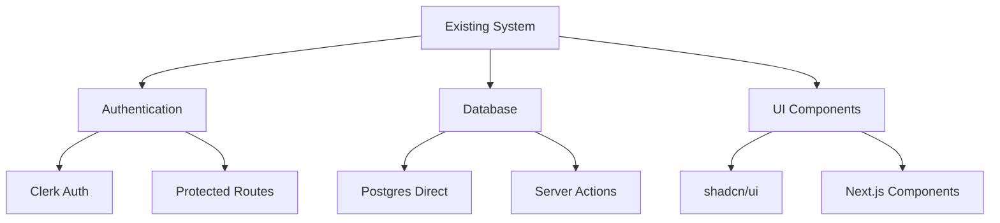
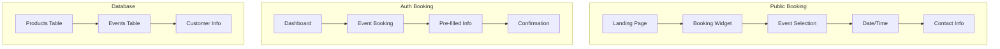
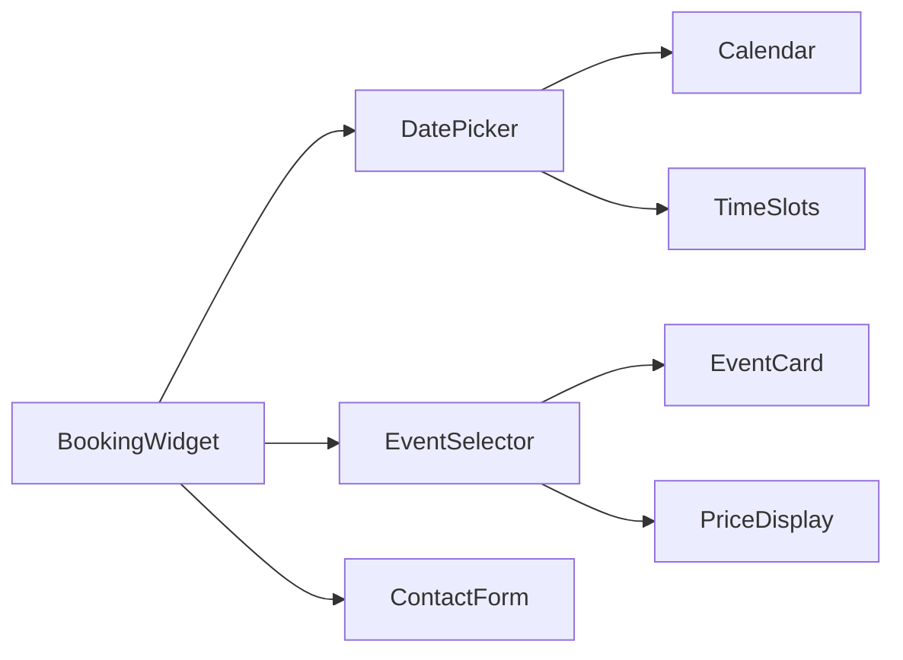
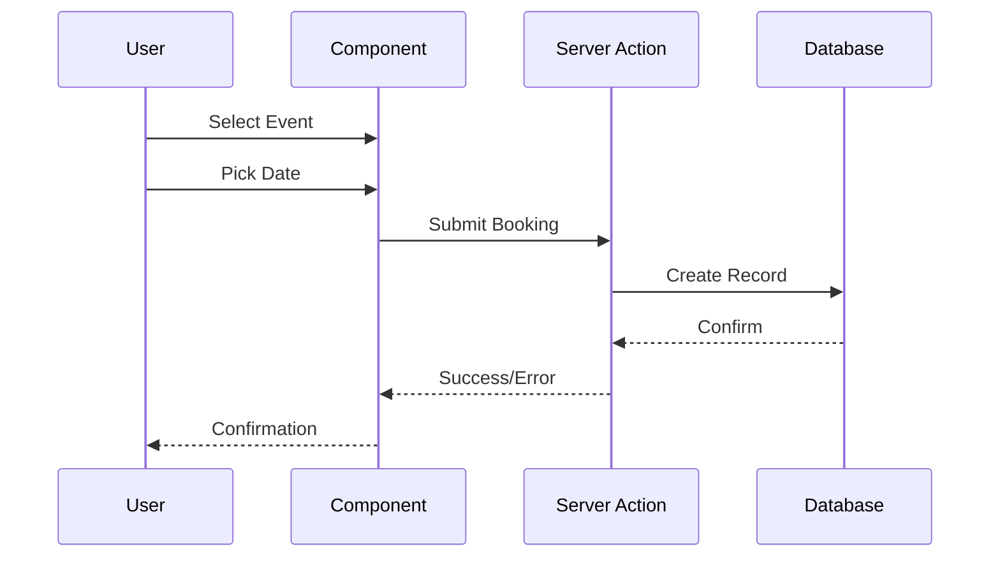

# Booking System Enhancement Task
Status: Started
Timestamp: 2024-02-24 14:39 CST

## Overview
Implement booking functionality for both authenticated and non-authenticated users, leveraging existing infrastructure and adding new features where needed.

## Current System Analysis



## Proposed Changes



## Implementation Plan

### 1. Database Integration
Using existing postgres setup:
```sql
-- Add event_type to products table
ALTER TABLE products ADD COLUMN IF NOT EXISTS event_type VARCHAR(50);

-- Add sample event products
INSERT INTO products (
  id, 
  name, 
  price, 
  description, 
  category,
  event_type
) VALUES 
  ('evt_balloon', 'Balloon Party', 15000, 'Setting up balloon directions', 'events', 'party'),
  ('evt_tent', 'Kids Tent Party', 25000, 'Set up tents for your slumber party / birthday party', 'events', 'party');
```

### 2. Component Structure


### 3. Route Structure
```
app/
├── (public)/
│   └── book/
│       └── page.tsx      # Public booking page
└── dashboard/
    └── events/
        ├── page.tsx      # Auth booking & management
        └── [id]/
            └── page.tsx  # Event details
```

## Technical Implementation

### 1. Server Actions (app/lib/actions/events.ts)
```typescript
'use server'

export async function createBooking({
  productId,
  date,
  customerId,  // optional, for auth users
  contactInfo  // required for non-auth
}) {
  // Use existing sql client
  const bookingId = `book_${Date.now()}`;
  await sql`
    INSERT INTO bookings (id, product_id, date, customer_id)
    VALUES (${bookingId}, ${productId}, ${date}, ${customerId})
  `;
}
```

### 2. Data Fetching (app/lib/data.ts)
```typescript
export async function fetchEventProducts() {
  // Use existing pattern
  const products = await sql<Product[]>`
    SELECT * FROM products 
    WHERE category = 'events'
    ORDER BY name ASC
  `;
  return products;
}
```

### 3. UI Components
- Reuse existing shadcn/ui components:
  - Calendar (already installed)
  - Button
  - Input
  - Card

## Integration Points



## Best Practices Adherence
1. Next.js 15.1.7
   - Server Components by default
   - Client Components when needed
   - Server Actions for mutations
   - Proper error boundaries

2. Authentication
   - Leverage existing Clerk setup
   - Maintain route protection
   - Handle both auth/non-auth flows

3. Database
   - Use existing postgres patterns
   - Maintain type safety
   - Follow current error handling

4. Components
   - Follow shadcn/ui patterns
   - Maintain accessibility
   - Proper loading states

## Rollout Plan
1. Add event products to database
2. Create booking components
3. Implement server actions
4. Add public booking route
5. Enhance dashboard with booking management

## Success Metrics
- Successful bookings through both flows
- Proper error handling
- Type safety throughout
- Maintained performance
- No regression in existing features

Would you like me to proceed with implementing this plan? We can start with:
1. Adding event products to the database
2. Creating the booking components
3. Implementing the server actions

Please let me know if you want to adjust any part of this plan before we proceed.
