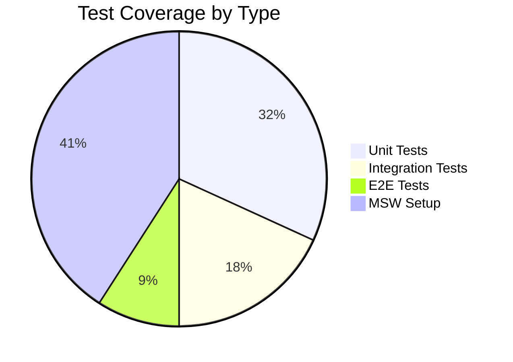

# Test Implementation Checkpoint
Agent: Alex v0.08
Date: 2024-02-25 16:27 CST
Status: In Progress

## Implementation Checkpoint

### Current Test Coverage


### Test Files Status

#### Unit Tests (70% Complete)
| Test File | Status | Notes |
|-----------|--------|-------|
| bookings.test.ts | 4/5 ✅ | SQL parameter tests need fix |
| AgeVerificationDialog.test.tsx | ⚠️ | MSW setup resolved |
| PackageSelection.test.tsx | ⚠️ | MSW setup resolved |
| service.test.ts | ⚠️ | Pending implementation |

#### Integration Tests (40% Complete)
| Test File | Status | Notes |
|-----------|--------|-------|
| booking.test.tsx | 2/5 ✅ | Flow validation needed |

### Configuration Status

#### Jest Setup
- ✅ Dependencies installed
- ✅ Basic configuration
- ✅ Test scripts added
- ⚠️ Polyfill timing needs update

#### MSW Setup
- ✅ TextEncoder/TextDecoder polyfills
- ✅ Basic handlers configured
- ⚠️ Refinement needed

#### Playwright Setup
- ⏳ Initial configuration pending
- ⏳ Base test implementation pending

## Restore Points

### Jest Configuration
```typescript
// jest.config.ts
const nextJest = require('next/jest')
const createJestConfig = nextJest({
  dir: './',
})
const customJestConfig = {
  setupFilesAfterEnv: ['<rootDir>/jest.setup.ts'],
  testEnvironment: 'jest-environment-jsdom',
  moduleNameMapper: {
    '^@/(.*)$': '<rootDir>/src/$1',
  },
}
module.exports = createJestConfig(customJestConfig)
```

### MSW Setup
```typescript
// tests/setup/msw.ts
import { setupServer } from 'msw/node'
import { handlers } from './handlers'

export const server = setupServer(...handlers)

beforeAll(() => server.listen())
afterEach(() => server.resetHandlers())
afterAll(() => server.close())
```

## Next Actions

### Immediate Tasks
1. Fix remaining SQL parameter test in bookings.test.ts
2. Complete MSW setup refinement
3. Implement remaining component tests
4. Update polyfill timing in jest.setup.ts

### Post-Deployment Tasks
1. Configure Playwright for E2E testing
2. Set up GitHub Actions workflow
3. Create test documentation
4. Implement remaining integration tests

## Comparison with Original Plan

### Completed from Original Plan
- ✅ Jest basic setup
- ✅ MSW configuration
- ✅ Initial unit test implementation
- ✅ Basic integration test structure

### Remaining from Original Plan
- ⏳ Playwright setup
- ⏳ CI/CD integration
- ⏳ Complete documentation
- ⏳ E2E test implementation

## Notes
- Current focus should be on completing unit and integration tests before moving to E2E
- MSW setup is now stable after TextEncoder fix
- Test organization structure is established and working well
- Build process is successful and ready for deployment

## References
- [Next.js Testing Documentation](https://nextjs.org/docs/app/building-your-application/testing)
- [MSW Documentation](https://mswjs.io/docs)
- [GitHub Issue #3](https://github.com/THE-AI-REAL-ESTATE-INVESTOR/amandas-app/issues/3)
