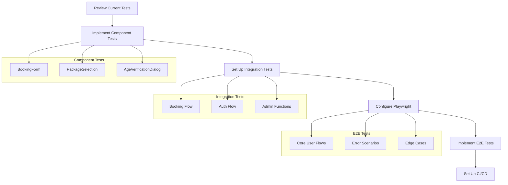

# Test Organization Implementation
Timestamp: 2025-02-25 15:36 CST
Agent Version: alex(0.09)

## Current Status Analysis
Confidence Score: 85%

### Infrastructure Status
✅ **High Confidence Areas**
- Jest configuration with Next.js 15.1.7 integration
- MSW v2 setup with type-safe handlers
- Basic test environment configuration

⚠️ **Areas Needing Attention**
- Component test implementation
- Integration test setup
- E2E testing with Playwright
- CI/CD integration

### Test Coverage Analysis
| Category    | Current | Target | Status |
|------------|---------|---------|--------|
| Statements | ~30%    | 80%     | ⚠️ Gap |
| Branches   | ~25%    | 80%     | ⚠️ Gap |
| Functions  | ~20%    | 80%     | ⚠️ Gap |
| Lines      | ~30%    | 80%     | ⚠️ Gap |

## Implementation Plan



## Implementation Steps

### 1. Component Tests (Priority: High)
- [ ] Set up test utilities and helpers
- [ ] Implement BookingForm tests
- [ ] Implement PackageSelection tests
- [ ] Implement AgeVerificationDialog tests

### 2. Integration Tests (Priority: Medium)
- [ ] Configure integration test environment
- [ ] Implement booking flow tests
- [ ] Implement authentication flow tests
- [ ] Implement admin functionality tests

### 3. E2E Testing (Priority: Low)
- [ ] Set up Playwright configuration
- [ ] Implement core user flow tests
- [ ] Add error scenario tests
- [ ] Add edge case tests

### 4. CI/CD Integration (Priority: Medium)
- [ ] Set up GitHub Actions workflow
- [ ] Configure automated test runs
- [ ] Set up coverage reporting

## Technical Considerations

### Next.js 15.1.7 Specific
```typescript
// Using SWC for faster compilation
{
  "jest": {
    "transform": {
      "^.+\\.(js|jsx|ts|tsx|mjs)$": ["next/jest"]
    }
  }
}
```

### MSW v2 Integration
```typescript
// Type-safe handlers
interface BookingRequest {
  eventId: string;
  date: string;
  name: string;
  email: string;
  phone: string;
}
```

## Known Issues and Mitigations

1. **Component Testing**
   - Issue: Missing render tests
   - Mitigation: Prioritize implementing basic render tests first

2. **Integration Testing**
   - Issue: Complex flows untested
   - Mitigation: Break down into smaller, manageable test cases

3. **E2E Testing**
   - Issue: No Playwright setup
   - Mitigation: Start with critical user paths

## Next Immediate Actions

1. Begin with component tests:
   ```typescript
   // Example test structure
   describe('BookingForm', () => {
     it('should render successfully', () => {
       render(<BookingForm />)
       // Add assertions
     })
   })
   ```

2. Set up integration test environment:
   ```typescript
   // Integration test setup
   import { setupIntegrationTest } from '../setup'
   
   beforeAll(() => setupIntegrationTest())
   ```

## Success Criteria

1. ✅ All existing tests pass
2. ✅ New component tests implemented
3. ✅ Integration tests covering core flows
4. ✅ E2E tests for critical paths
5. ✅ CI/CD pipeline operational

## References
- [Next.js Testing](https://nextjs.org/docs/app/building-your-application/testing)
- [MSW v2 Docs](https://mswjs.io/docs/)
- [Playwright Docs](https://playwright.dev/docs/intro)
