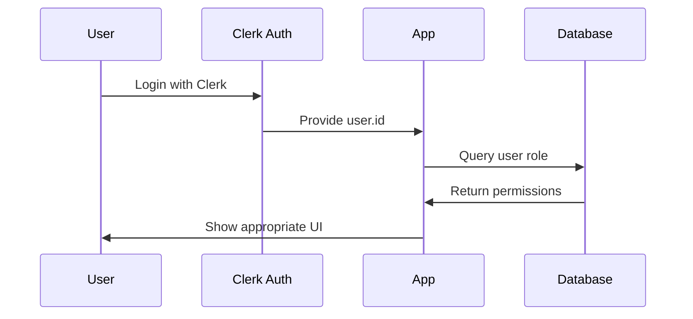

# Authentication System Enhancement
Status: Completed
Timestamp: 2024-02-24 18:46 CST

## Completed Tasks

### 1. Authentication Infrastructure
- Implemented Clerk middleware with proper route protection
- Added role-based access control for admin routes
- Set up public route definitions
- Protected dashboard and admin routes

### 2. Database Schema Updates
```sql
-- Added users table with auth fields
CREATE TABLE users (
  id VARCHAR(255) PRIMARY KEY,
  clerk_id VARCHAR(255) UNIQUE NOT NULL,
  role VARCHAR(50) NOT NULL DEFAULT 'user',
  first_name VARCHAR(255),
  last_name VARCHAR(255),
  email VARCHAR(255)
);

-- Updated bookings table with auth fields
CREATE TABLE bookings (
  id VARCHAR(255) PRIMARY KEY,
  event_id VARCHAR(255) NOT NULL,
  date TIMESTAMP NOT NULL,
  customer_name VARCHAR(255),
  customer_email VARCHAR(255),
  customer_phone VARCHAR(255),
  user_id VARCHAR(255),
  status VARCHAR(50) NOT NULL DEFAULT 'pending',
  created_at TIMESTAMP DEFAULT CURRENT_TIMESTAMP,
  FOREIGN KEY (user_id) REFERENCES users(clerk_id)
);
```

### 3. Server Actions Enhancement
- Updated booking creation with user tracking
- Added role-based status handling
- Enhanced event queries with proper permissions
- Added proper error handling for auth failures

### 4. Project Structure Documentation
- Created cursor-rules for Next.js conventions
- Documented project organization best practices
- Added route group and component organization guidelines

### 5. Type System Updates
- Enhanced Event type with proper fields
- Added EventResponse type for better error handling
- Updated booking types with auth fields

## Current Working State

### Authentication Flow


### Working Features
- ✅ Public booking creation
- ✅ User authentication
- ✅ Role-based access control
- ✅ Admin view all bookings
- ✅ User-specific booking views
- ✅ Status management
- ✅ Route protection

### Known Issues
1. Need to implement admin layout structure
2. Missing proper route grouping
3. Component organization needs restructuring

## Next Steps
1. Implement proper route groups (auth), (public)
2. Create admin layout with navigation
3. Reorganize components into _components structure
4. Add user management interface
5. Implement audit logging

## Documentation Added
1. cursor-rules/next-js-conventions.md
2. cursor-rules/project-organization.md

## Git Status
Ready to commit with message:
"feat(auth): Implement authentication system with Clerk

- Add Clerk middleware with role-based access
- Update database schema for auth
- Enhance server actions with auth
- Add project structure documentation
- Update type system for auth support"
