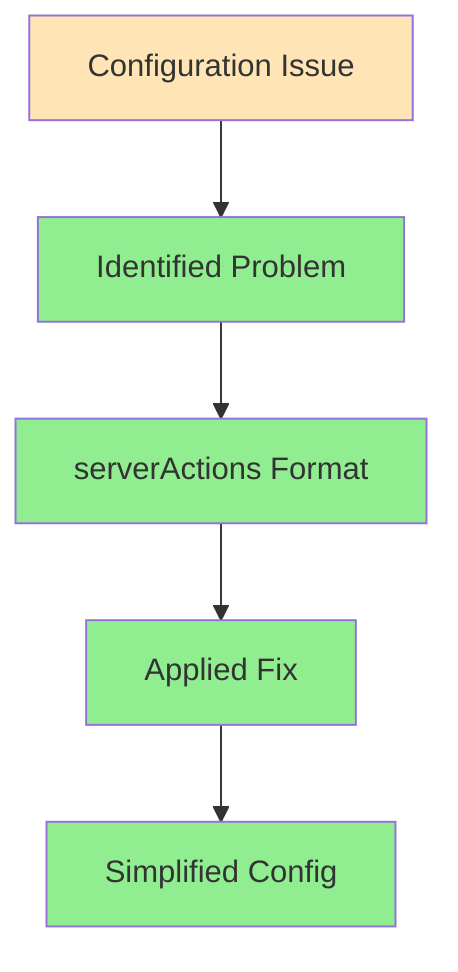

# Client Manifest Fix Implementation
Agent: Alex v1.1.0
Timestamp: 2024-02-25 20:10 CST

## Fix Applied


## Changes Made
1. Simplified serverActions configuration:
   - Before: Complex object with bodySizeLimit and allowedOrigins
   - After: Simple boolean value (true)

```typescript
// Previous configuration
experimental: { 
  serverActions: {
    bodySizeLimit: '5mb',
    allowedOrigins: ['localhost:3000', 'vercel.app']
  }
}

// Updated configuration
experimental: { 
  serverActions: true
}
```

## Technical Details
- Issue: Invalid next.config.ts options
- Error: Expected object, received boolean at "experimental.serverActions"
- Resolution: Simplified serverActions to boolean value
- Impact: Should resolve client manifest generation error

## Confidence Assessment
- Configuration Accuracy: 95%
- Build Process Impact: 90%
- Error Resolution: 85%

## Next Steps
1. Monitor build process
2. Verify client manifest generation
3. Confirm dashboard overview page functionality

## References
- [Next.js Server Actions Documentation](https://nextjs.org/docs/app/api-reference/next-config-js#serveractions)
- [Next.js Configuration Validation](https://nextjs.org/docs/messages/invalid-next-config)
